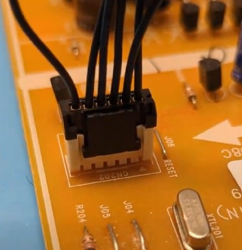

# Samsung Oven / Range Reverse Engineering & Repair

This repository holds various technical information about reverse engineering Samsung oven control board(s).

*NOTE: This project is not affiliated with or endorsed by Samsung, Toshiba, or any related company.*

# Related Resources

# Status 

As of June 9 / 2023 - this is being actively updated, check back in a few days!

# Relevant Boards / Ranges

**WARNING:** The "revision" number after the part number makes for *drastic* differences in the functionality. Do NOT flash a board with a different firmware, it WILL NOT work and may result in SUBSTANTIAL damage as it may be trying to turn on things that are connected differently.

The DE92-02439 series was the main focus of this work. The specific variant will change for your oven, for example DE92-02439D used in mine (FE710S) won't work in an oven expecting a DE92-02439F board!

The DE92-03960 used in later ovens uses a R5F100LEAFB, which is an entirely different processor.

# DE92-02439 (TMP91FW60 Based) Specific

## Firmware Tweaks

**WARNING**: Your oven is normally connected directly to a high-power (220V/30A) socket. The oven firmware **DIRECTLY** controls the heating element. Changing the firmware means the oven could turn the heating element on full-blast suddenly while you are away. You should **ONLY** apply such changes for testing purposes with appropriate backup controls.

## Reflashing Firmware Tools

The best bet is the [The μArt Kit](https://www.crowdsupply.com/signoid/muart#products). This gets you a 5V-compatable isolated USB-SERIAL adapter. This can be used to reflash things in the field.

### Connector Pinout

The connector pinout is helpfully marked on the PCB:

* EMU0 - connects to BOOT0 pin on TMP91FW60. Set LOW to force boot mode entry.
* RXD1 - RX (input) pin, connect to TXD on serial interface. Logic-level.
* TXD1 - TX (output) pin, connect to RXD on serial interface. Logic-level.
* GND - GND/0V.
* 5V - 5V output. If board isn't connected you can feed in power here. The chip works at 3.3V as well (feed 3.3V in here), will only take ~50mA. For flashing on the bench this is easiest way, since you can power it at 3.3V and use more common 3.3V logic level. Also can use ChipWhisperer scripts this way too.
* RESET - active low reset. Used to enter/exit bootloader mode.

### Mating Connector

I don't know the real connector, but I found that 2181021061 seemed to work. It doesn't fully seat, but seems to work:

## Reverse Engineering Technical Details 

# DE92-03960 (R5F100LEAFB - RL78/G13) Specific